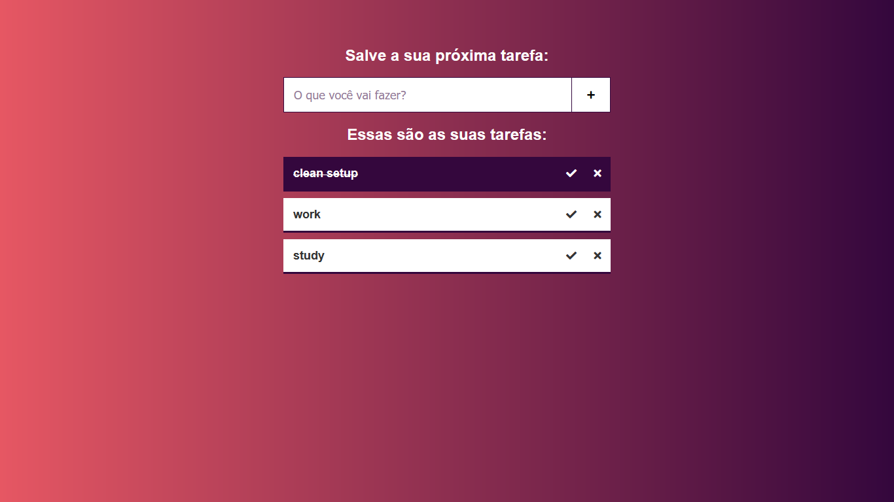

# To-Do-JavaScript
A simple project for adding and removing tasks. To practice the basics of javascript

## About the project

Simple website developed during the tutorial: <a href="https://www.youtube.com/playlist?list=PLnDvRpP8BneysKU8KivhnrVaKpILD3gZ6">Curso de JavaScript</a> of the channel <a href="https://www.youtube.com/c/MatheusBattisti" >Matheus Battisti - Hora de Codar</a> 

<ul>
<li> access the page <a href="https://lucavini.github.io/To-Do-JavaScript/">here</a> </li></ul>

### Screenshots

